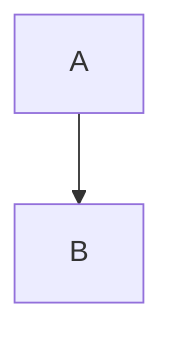
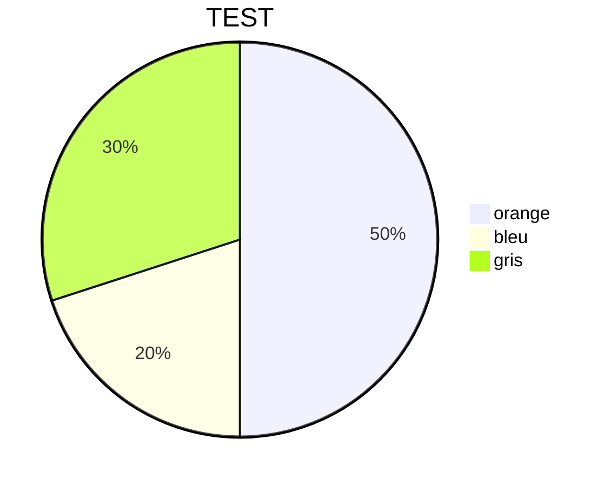
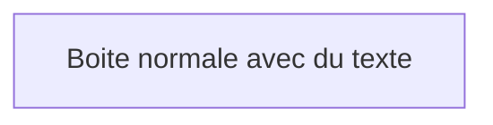
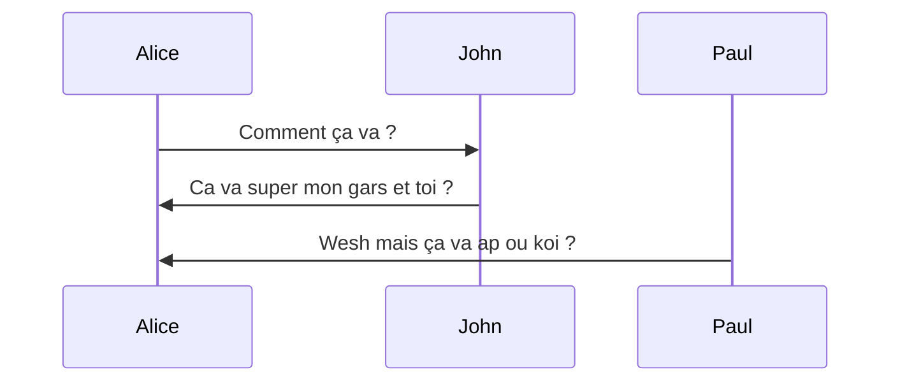
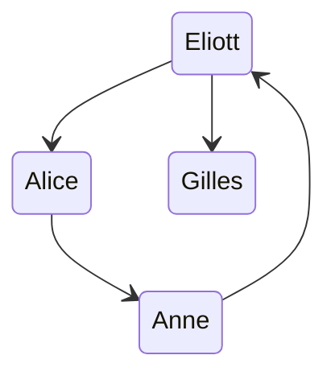

# Créer des diagrammes dans Obsidian
Créateur : [[Productivity Guru]]
Projet relié : [[IDÉES DE VIDÉOS]][[V -  Tutoriel Obsidian]]
Contenu lié : [[Comment développer des outils pour mieux penser]]
Date de prise en note : [[2020-11-12]]
***

# Notes
Pour faire des diagrammes, il faut toujouts utiliser la forme :

mermaid
(le type de graphique) + ==title + (le nom de graph)== => (seulement si pie)
(les paramètres)

## Pour des Graphs

4 types : TB BT LR RL (en fonction de la direction)

## Pour des Pie

## Pour des formes
(à insérer par exemple dans des graphs)

### Types :
boxa[Boite normale avec du texte] => carré
boxa([Boite normale avec du texte]) => médicament
boxa(Boite normale avec du texte) => carré coins arrondis
boxa[[Boite normale avec du texte]] => carré avec une mage interne
boxa[(Boite normale avec du texte)] => cylindre
boxa((Boite normale avec du texte)) => rond
boxa>Boite normale avec du texte] => assymétrique
boxa{Boite normale avec du texte} => losange
boxa[/Boite normale avec du texte/] => parralélogramme
boxa[Boite normale avec du texte] => carré

# Les types de liens dans un graph
--- => open
--text--> => dirigé mais avec un texte au milieu
-.-> => pointillé
==> Grosse flèche

# Les diagrammes de séquence

# State Diagram
